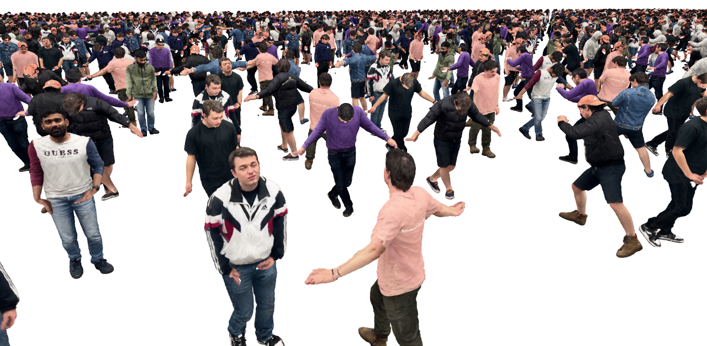

# 3DGS Crowd Viewer


This repository is a modified version of [GaussianSplattingViewer](https://github.com/limacv/GaussianSplattingViewer). For rasterization, we use [diff-gaussian-rasterization-memory-optimized
](https://github.com/RockyXu66/diff-gaussian-rasterization-memory-optimized), a memory-optimized version of [diff-gaussian-rasterization](https://github.com/graphdeco-inria/diff-gaussian-rasterization) designed for our crowd rendering. 

A huge thanks to the original authors for their contributions and for open-sourcing their work! 🚀


We use this lightweight viewer to visualize our crowd rendering, evaluate rendering speed and memory usage.



Screenshot of CrowdSplat running at 31 FPS on an RTX4090 with 3,500 animated characters.

# Install

Test under Ubuntu 22.04 with cuda 11.8

```
conda create -n gs-crowd-viewer python=3.9 -y

conda activate gs-crowd-viewer

pip install torch==2.3.0 torchvision==0.18.0 torchaudio==2.3.0 --index-url https://download.pytorch.org/whl/cu118

mkdir submodules

git clone git@github.com:RockyXu66/diff-gaussian-rasterization-memory-optimized.git --recursive submodules/diff-gaussian-rasterization-memory-optimized

pip install -r requirements.txt

pip install cuda-python loguru

pip install submodules/diff-gaussian-rasterization-memory-optimized
```

Download the sample characters and motions from [GoogleDrive](https://drive.google.com/file/d/1-EPfsME-CKIEIKlUVeQRAsVbtuutWbbS/view?usp=sharing), unzip the file and put them under the root.
```
<location>
|---gs-crowd-avatars
|   |---models
|   |---motions
|---
    |---submodules
        |---diff-gaussian-rasterization-memory-optimized
```

# Usage

```
python main.py
```

# TODO

- [ ] Add the script for generating motion files from AMASS
